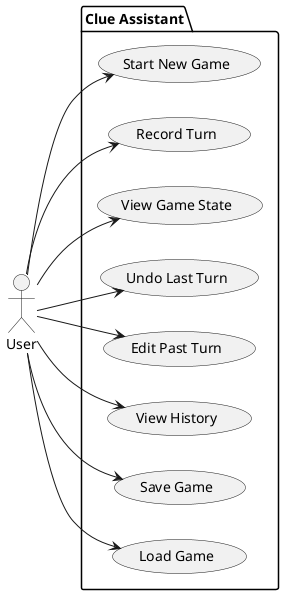
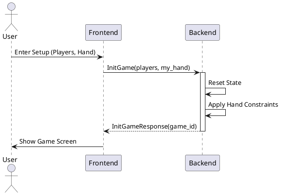
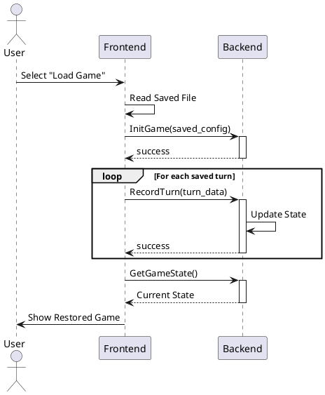
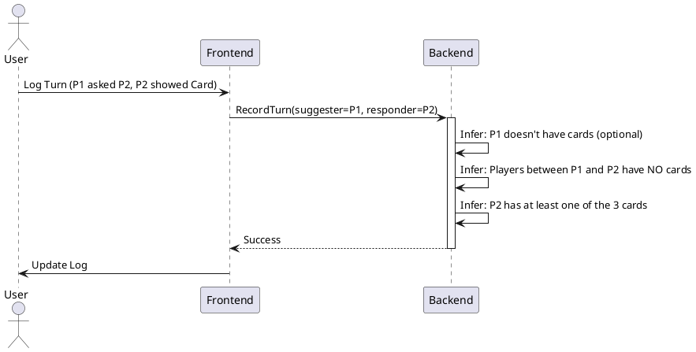
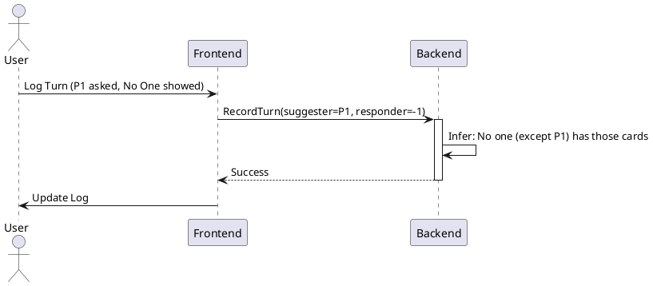
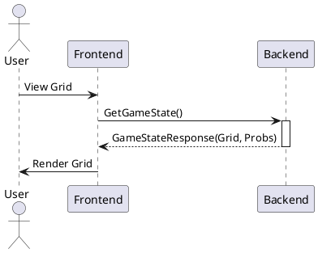
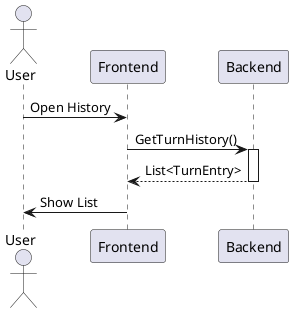
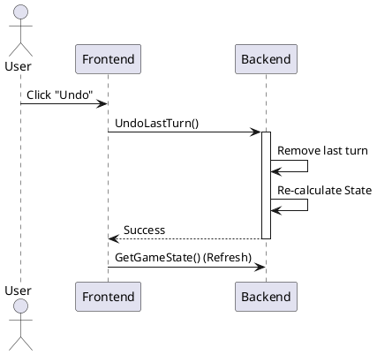
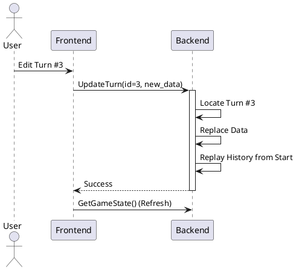

# Clue Assistant API Documentation

This document outlines the API interaction between the Frontend (Flutter Application) and the Backend (C++ Service) for the Clue Assistant project. It also covers client-side logic for specific use cases like Saving and Loading games.

## Overview

The Clue Assistant allows users to track the state of a Clue game. The Backend acts as the "Source of Truth," managing the game logic, deduction grid, and probability calculations using an Event Sourcing pattern. The Frontend is a presentation layer that sends user actions (Turns) to the backend and renders the resulting State.

Communication is performed via gRPC.

## High-Level Use Cases

The following diagram depicts the core capabilities available to the user.

## Game Management

### Initialize Game (InitGame)

Starts a new game session. The backend resets its state, initializes the players, and processes the user's starting hand to apply initial constraints.

*   **RPC:** `InitGame`
*   **Request:** `InitGameRequest` (num_players, player_names, my_hand)
*   **Response:** `InitGameResponse` (game_id, success, error_message)

### Save Game

*Client-Side Logic*

The backend is stateless regarding sessions across restarts (unless persistence is added later), so the Frontend is responsible for saving the game data.
To save a game, the Frontend serializes:
1.  The initial configuration (Players, User's Hand).
2.  The complete list of Turn objects recorded so far.

This data is stored in a local file or local storage.

### Load Game

*Client-Side Logic*

To load a game, the Frontend performs a "Replay" of the saved history against a fresh Backend session.

1.  Read saved configuration and turns.
2.  Call `InitGame` with the saved configuration.
3.  Loop through saved turns and call `RecordTurn` for each.
4.  Finally, call `GetGameState` to sync the UI.

## Gameplay Loop

### Record Turn (RecordTurn)

Submits a new turn to the backend. The backend appends this turn to the history and updates the deduction grid based on the new constraints.

*   **RPC:** `RecordTurn`
*   **Request:** `TurnRequest` containing `TurnData`:
    *   `suggester_player_index`: Who asked.
    *   `suspect`, `weapon`, `room`: The cards in the suggestion.
    *   `responder_player_index`: Who showed a card. Set to `-1` if **No One** showed a card.
    *   `card_shown` (Optional): The specific card shown (if known to the user).
    *   `is_accusation`: Boolean indicating if this was an Accusation (final guess).
    *   `was_correct`: Boolean, relevant only if `is_accusation` is true.
        *   If `true`: The game ends, and the Case File is set to `{suspect, weapon, room}`.
        *   If `false`: The Case File CANNOT be exactly `{suspect, weapon, room}`.
*   **Response:** `TurnResponse` (success, error_message)

**Scenario 1: Player Responds**

**Scenario 2: No One Responds**

### Get Game State (GetGameState)

Retrieves the current calculated state of the deduction grid and solution probabilities. This should be called after `InitGame`, `RecordTurn`, `UndoLastTurn`, or `UpdateTurn` to refresh the UI.

*   **RPC:** `GetGameState`
*   **Request:** `GameStateRequest`
*   **Response:** `GameStateResponse`
    *   `players`: List of players.
    *   `rows`: The Grid (rows for Suspects, Weapons, Rooms). Each row contains `CellState` for each player (HAS, DOES_NOT_HAVE, MIGHT_HAVE, UNKNOWN).
    *   `solution_probabilities`: Calculated probability for each card being part of the solution.

## History & Corrections

### Get Turn History (GetTurnHistory)

Fetches the list of all recorded turns. Used by the "Edit History" or "Game Log" screen.

*   **RPC:** `GetTurnHistory`
*   **Request:** `GetHistoryRequest`
*   **Response:** `GetHistoryResponse` (List of `TurnEntry`)

### Undo Last Turn (UndoLastTurn)

Removes the most recent turn. Useful for immediate corrections.

*   **RPC:** `UndoLastTurn`
*   **Request:** `UndoRequest`
*   **Response:** `UndoResponse` (success)

### Update Turn (UpdateTurn)

Modifies a specific past turn. This triggers a full state recalculation (Replay) on the backend to ensure consistency.

*   **RPC:** `UpdateTurn`
*   **Request:** `UpdateTurnRequest` (turn_id, new_data)
*   **Response:** `TurnResponse` (success)

