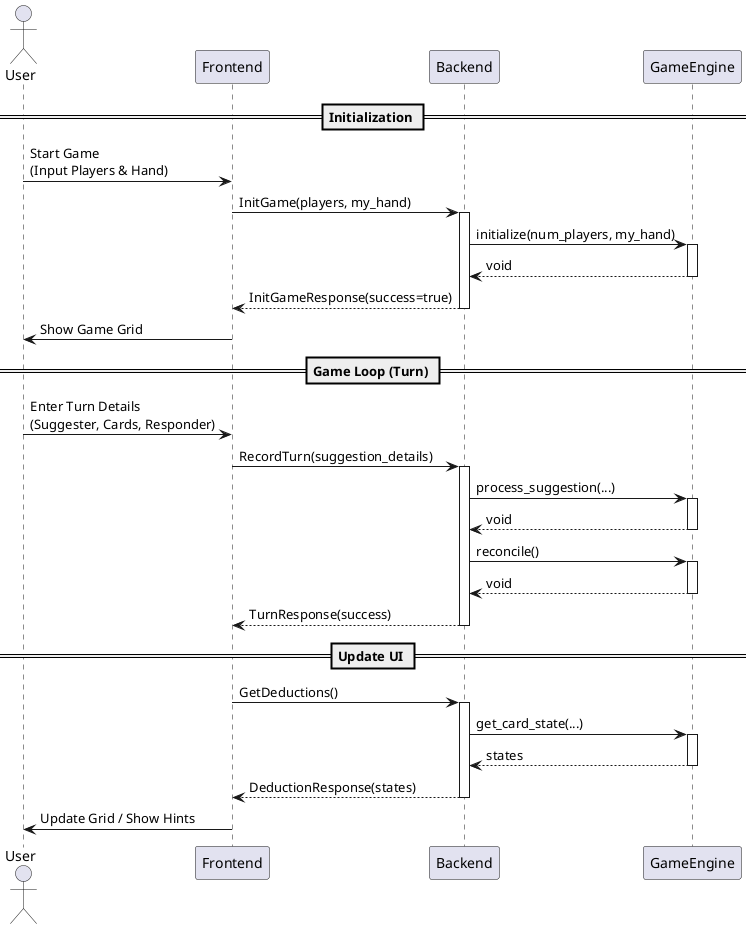

# Clue Game API Documentation

This document describes the API for the Clue Game Tracker. The system is architected as a client-server application where the **Frontend** (Flutter) communicates with the **Backend** (C++) via **gRPC**.

The Backend wraps the `GameEngine` (CoreLib), which handles the constraint solving and deduction logic.

## 1. Existing API (Current Implementation)

The current `libraries/messages/clue.proto` defines the basic structures and a status endpoint.

### Enums

#### CardType
*   `CARD_TYPE_UNKNOWN` (0)
*   `CARD_TYPE_SUSPECT` (1)
*   `CARD_TYPE_WEAPON` (2)
*   `CARD_TYPE_ROOM` (3)

#### Suspect
*   `SUSPECT_UNKNOWN` (0)
*   `SUSPECT_COL_MUSTARD` (1)
*   ... (See proto file for full list) ...
*   `SUSPECT_MRS_WHITE` (6)

#### Weapon
*   `WEAPON_UNKNOWN` (0)
*   `WEAPON_KNIFE` (1)
*   ...
*   `WEAPON_WRENCH` (6)

#### Room
*   `ROOM_UNKNOWN` (0)
*   `ROOM_HALL` (1)
*   ...
*   `ROOM_STUDY` (9)

### Service: `ClueGameService`

#### `GetGameStatus`
Retrieves the status of the game backend.

*   **Request**: `GameStatusRequest`
    *   `game_id` (string): Identifier for the game session.
*   **Response**: `GameStatusResponse`
    *   `status` (string): Text description of status.
    *   `is_active` (bool): Whether a game is currently running.

---

## 2. Proposed API Design (Future Implementation)

This section describes the API endpoints required to expose the `GameEngine` functionality found in `libraries/corelib/include/GameEngine.h`.

### Service: `ClueGameService` (Extensions)

#### `InitGame`
Initializes a new game session. Maps to `GameEngine::initialize`.

*   **Request**: `InitGameRequest`
    *   `num_players` (int32): Total number of players.
    *   `my_hand` (repeated Card): The cards held by the tracking player (Player 0).
    *   `num_suspects` (int32, optional): Defaults to 6.
    *   `num_weapons` (int32, optional): Defaults to 6.
    *   `num_rooms` (int32, optional): Defaults to 9.
*   **Response**: `InitGameResponse`
    *   `game_id` (string): Session ID for the initialized game.
    *   `success` (bool): `true` if initialization was successful.

#### `RecordTurn`
Records a suggestion made by a player and the result (who showed a card). Maps to `GameEngine::process_suggestion` and `reconcile`.

*   **Request**: `TurnRequest`
    *   `game_id` (string): Session ID.
    *   `suggester_index` (int32): Index of the player making the suggestion (0-based).
    *   `suspect` (Card): The suspect suggested.
    *   `weapon` (Card): The weapon suggested.
    *   `room` (Card): The room suggested.
    *   `responder_index` (int32): Index of the player who showed a card (-1 if nobody showed).
    *   `response_card` (Card, optional): The specific card shown (if known to Player 0).
*   **Response**: `TurnResponse`
    *   `success` (bool): `true` if the turn was valid and processed.
    *   `new_deductions_count` (int32): Number of new facts deduced from this turn.

#### `GetDeductions`
Retrieves the current state of knowledge for all cards and players. Maps to `GameEngine::get_card_state` and `GameEngine::get_case_file_state`.

*   **Request**: `DeductionRequest`
    *   `game_id` (string): Session ID.
*   **Response**: `DeductionResponse`
    *   `player_states` (map<int32, PlayerCardState>): Map of Player Index to their card states.
    *   `case_file_state` (map<string, int32>): Map of Card ID (string) to `CardState` enum.

*   **Support Types**:
    *   `CardState` (Enum): `UNKNOWN`, `KNOWN_TRUE`, `KNOWN_FALSE`.
    *   `PlayerCardState`: Contains a map or list of card states for that player.

## 3. Interaction Sequence Diagram

The following PlantUML diagram illustrates the interaction flow between the User, Frontend, Backend, and Game Engine.

